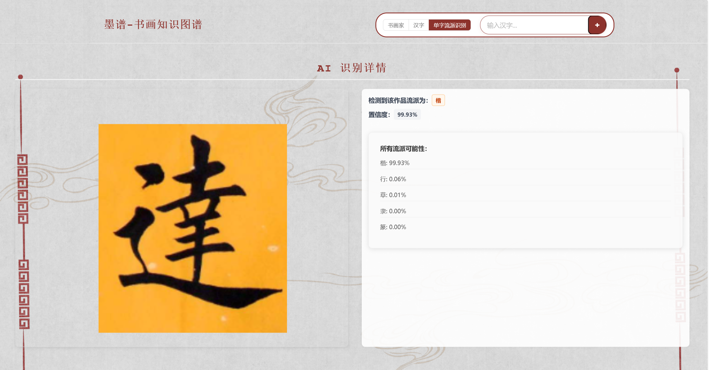
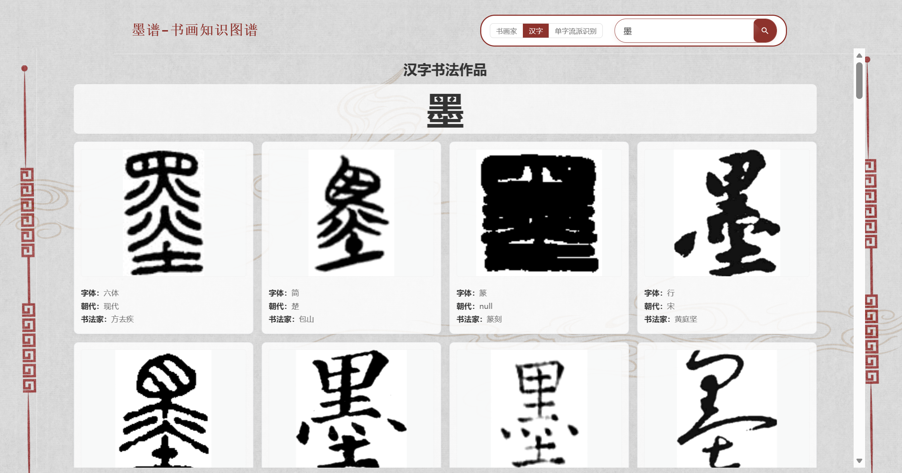

# 墨谱 —— 历代书法家多模态知识图谱构建与智能展示平台

## 项目简介

墨谱面向书法初学者与爱好者，针对“资料分散、功能单一、图文割裂”的痛点，将古籍文献转化为可检索、可交互的智能平台。首次融合知识图谱可视化、单字多书家比对、AI流派识别三大功能。

**在线体验**：http://39.106.11.186:5000
> 让书法知识“看得见、搜得到、比得清”

## 技术栈

- **前端**：HTML5 / CSS3 / JavaScript + ECharts + Fetch API
- **后端**：Python + Flask
- **数据库**：Neo4j
- **AI**：ResNet50 + PyTorch
- **部署**：Linux服务器
- **工具**：VS Code / Git / GitHub

## 核心功能

| 功能 | 说明 |
| :--- | :--- |
| 知识图谱可视化检索 | 搜索书法家，展示生平、师承、交游网络 |
| 单字多书家风格比对 | 输入汉字，同屏对比多位书家书写图片 |
| AI字体流派识别 | 上传图片，自动识别字体流派，输出Top-3置信度 |

## 项目亮点

- **首创融合**：知识图谱 + 单字比对 + AI识别，三合一，区别于现有产品仅提供单一功能
- **古籍活化**：完成《玉台书画史》《中国历代书法家图表》《中国书画史会要》三本古籍的知识抽取与标准化
- **OCR攻坚**：对比PaddleOCR、MinerU、百度智能云等方案，攻克竖排繁体古籍识别难题
- **模型落地**：自建数据集（训练集108,519张，测试集44,447张），ResNet50最佳验证准确率92.67%，预测代码加入智能反色预处理
## 界面预览

### 主界面

*平台首页，搜索框居中展示，支持书法家检索、汉字查询、AI图片识别三大入口*

### AI字体流派识别

*上传书法图片，自动识别字体流派，返回Top-3置信度结果*

### 单字风格对比

*输入任意汉字，同屏对比多位历代书家的书写风格*

### 知识图谱可视化

*搜索书法家后，交互式展示其生平、师承、交游网络，支持节点聚焦展开*

## 团队与分工

| 成员 | 负责板块 |
| :--- | :--- |
| 石渠阁（负责人） | 协调分工与设计、OCR、知识抽取、数据处理、流派识别模型训练 |
| 石一山 | OCR、知识抽取、同类产品调研、数据处理、开发字体检索功能、服务器部署 |
| 沈学伟 | OCR、Neo4j调试、后端开发、图片爬取与版权声明、演示视频 |
| 孙灵希 | OCR、数据处理、模型后端接口、数据合并上传、图片爬取 |
| 梁羽凡 | 网页框架、前端开发、美术设计、知识抽取、PPT美化 |

## AI模型详情

| 项目 | 内容 |
| :--- | :--- |
| 基础模型 | ResNet50（预训练） |
| 训练环境 | 本地 PC（NVIDIA GeForce RTX 4060 + Intel Core i9） |
| 训练框架 | PyTorch 2.5.1 + CUDA 12.3 |
| 数据集 | 训练集108,519张 / 测试集44,447张 |
| 最佳准确率 | 89.74%（验证集） |
| 识别类别 |楷、行、草、隶、篆 |
| 预处理 | 智能反色 + 二值化 + 中值滤波去噪 |
